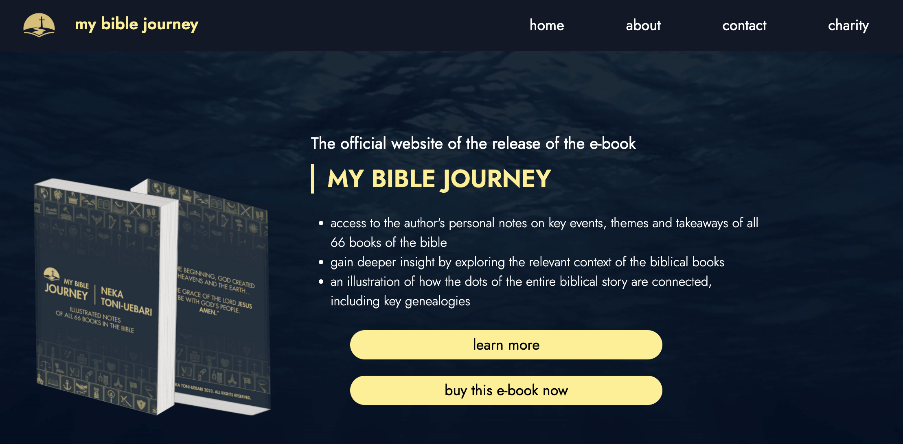
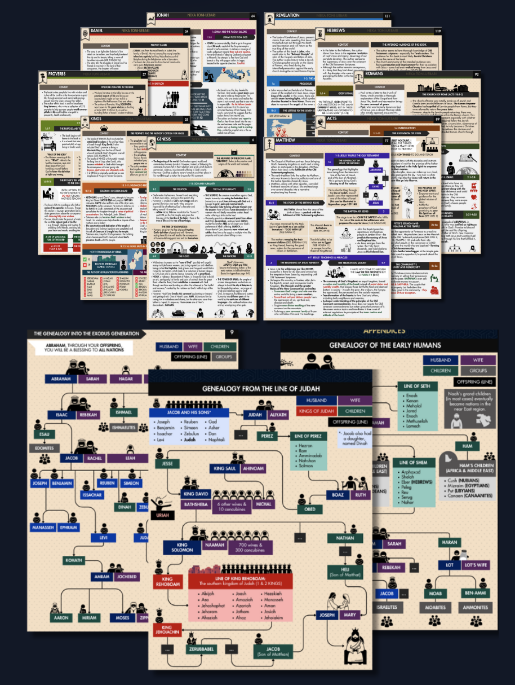
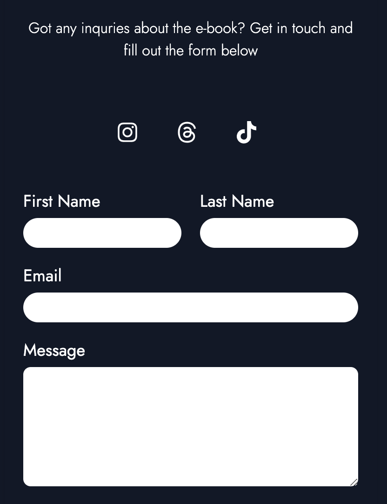

# MY BIBLE JOURNEY

This is a React and TailwindCSS application for the official release of the e-book. The intention of this book is to provide a digestive understanding of each book of the Bible for all students of the Bible. The official website includes various features such as the home page, preview, about, contact, and charities sections.

  
## Features

### 1. Home Page
- The home page introduces the e-book and provides an overview of its contents.
- Users can navigate to different sections of the website from the home page.

### 2. Preview
- The preview section allows users to get a sneak peek into the e-book's contents.
- Users can view sample chapters or excerpts to get an idea of the content.

### 3. About
- The about section provides information about the author or the project behind the e-book.
- Users can learn about the background, mission, testimony, and values of the author.

### 4. Contact
- The contact section includes a form that users can fill out to get in touch with the author.
- Users can submit queries, feedback, or requests for more information via the contact form.

### 5. Charities
- The charities section highlights external links to a selection of Christian charitable initiatives or partnerships.
- While these charities are not directly associated with the project, the users can choose out of their choice to go place a donation to a Christian charity.